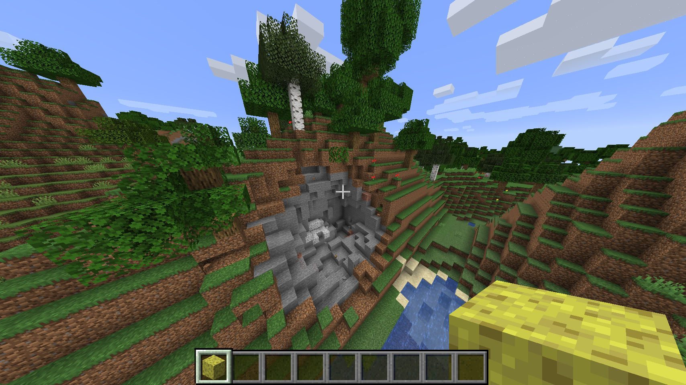
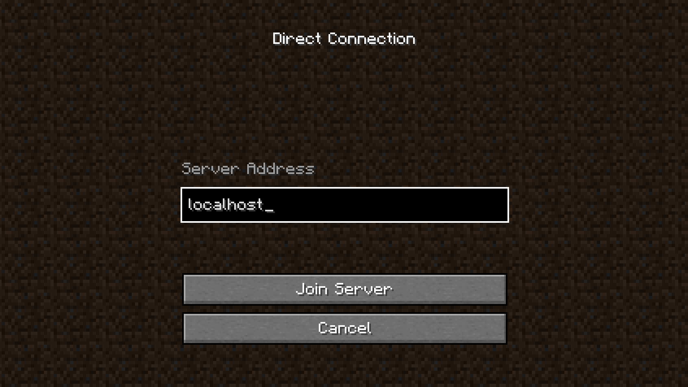
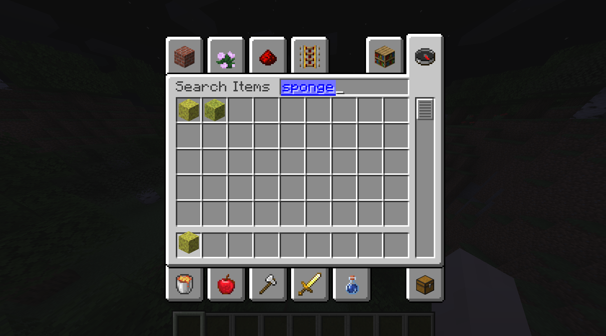

# Minecraft Plugin - Exploding Sponge

A basic Minecraft plugin that creates a small explosion at the location the player is looking when they left click while holding a [sponge](https://minecraft.gamepedia.com/Sponge).

## Project files
* `src/*` - Java source code
* `src/main/resources/plugin.yml` - Plugin description file
* `BuildTools.jar` - Used to generate the spigot JAR
* `pom.xml` - Maven configuration file
* `deploy-plugin.sh` - Builds the plugin and deploys it to the server
* `reset-server.sh` - Deletes the server and builds a new one
* `start-server.sh` - Starts the server
* `update-server.sh` - Downloads and installs latest spigot JAR

## How to run
Note: The following commands are meant to be run in a Unix terminal (Linux or Mac). For Windows, I recommend using [Git Bash](https://git-scm.com/downloads).

**Prerequisities**
* [Java 8+](https://www.java.com/en/download/)
* [Apache Maven 3+](https://maven.apache.org/download.cgi)

### First time setup
1. Execute `./update-server.sh`. This will create the spigot JAR necessary to run the server. It will take a few minutes.
2. Execute `./start-server.sh`. This will start the Minecraft server.
3. The first time the server starts, it will fail. You will receive a EULA warning. Open `server/eula.txt` in your favorite text editor and set `eula=true`. Save the file.
4. Run `./start-server.sh` again.
5. After the server has finished starting, launch your Minecraft client and join the server `localhost`. You should now be playing on your server.

### Restarting the server
1. Stop the Minecraft server by typing `stop` in the server console, or terminating the process.
2. Start the server again with `./start-server.sh`.
3. Rejoin the server `localhost` from your Minecraft client.

### Deploying the plugin
1. Make your desired code changes.
2. Stop the Minecraft server.
3. Run `./deploy-plugin.sh && ./start-server.sh` to build the plugin and relaunch the server with your new changes.
4. Rejoin the server `localhost` from your Minecraft client.

### Resetting the server
If you want to start over on a new world, follow these steps.
1. Stop the Minecraft server.
2. Execute `./deploy-plugin && ./reset-server.sh`. This will create a new Minecraft world from scratch.
3. The first time the server starts, it will fail. Open `server/eula.txt` in your favorite text editor and set `eula=true`. Save the file.
4. Execute `./start-server.sh`.
3. Rejoin the server `localhost` from your Minecraft client.

### Updating Minecraft version
Occassionally, new versions of Minecraft will be released and your server will go out of date. Follow these steps to remedy the issue.
1. Run `./update-server.sh` to retrieve the latest spigot JAR.
2. Stop the Minecraft server.
3. Run `./deploy-plugin.sh && ./start-server.sh` again.
4. Rejoin the server `localhost` from your Minecraft client.

## Notes
* To give yourself a sponge, type `gamemode creative [player]` in the server console, where `[player]` is the username of your Minecraft player. On your player, press `E` to open your inventory, and search for "sponge." Move the sponge to your hotbar.

